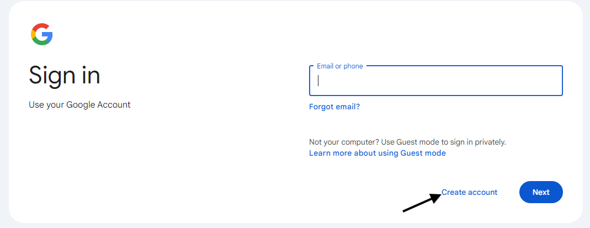
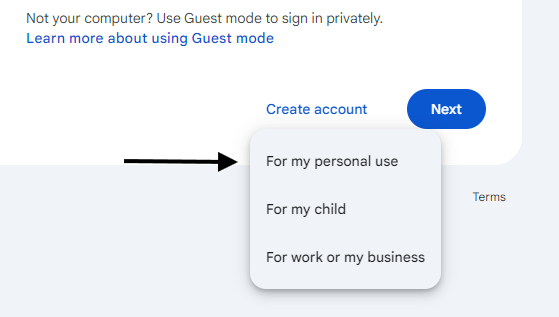

<link rel="stylesheet" href="style.css">

# ***Gmail Account Creation Guide***

**This guide will show you how to create a Gmail account from start to finish.**

## Procedure

***# Opening your browser***

1.) Locate your web browser which is usually located on the desktop of your computer.

2.) Once you find the browser icon, double click it to open the web browser.

3.) At the top of the browser in the URL bar type

`https://accounts.google.com/`

4.) Click on the *Create account* button

5.) Then click on the option that says *For my personal use*.

## Best Practices for Password Security

* Utilize a combination of uppercase and lowercase letters, numbers, and symbols
* Avoid incorporating easily guessable information such as your name, birthday, or pet's name
* Consider employing a password manager to generate and securely store complex passwords

## Additional Considerations

* Should you encounter any difficulties during the sign-up process, please refer to Google's official help resources
* Upon creating a Gmail account, you gain access to other Google services including Google Drive, Google Docs, and YouTube

**Your Gmail account is now ready for use**
